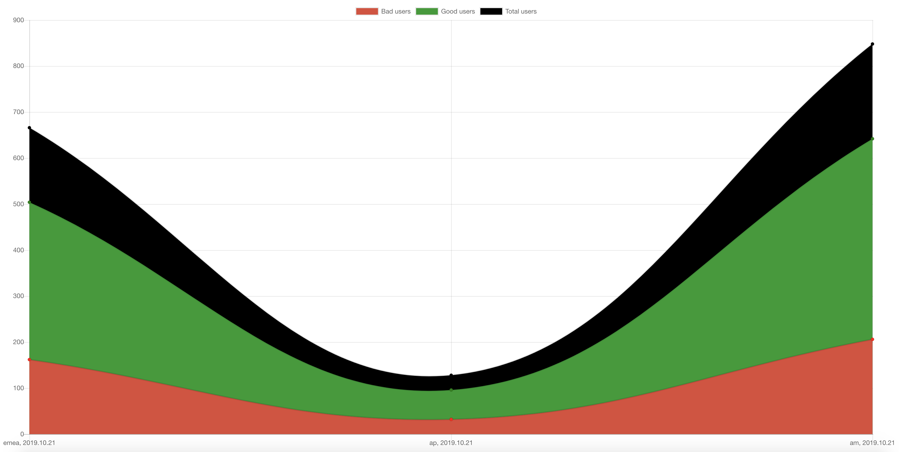

# charts

### Install yarn globally
for reference: https://yarnpkg.com/lang/en/docs/install/

### Install all packages in project folder
`yarn` or `yarn install`

### For development run
`yarn dev`

### Production:
`yarn start`

Open app locally: http://localhost:5001

You should see `line` chart:

For charts documentation, please refer to oficial `ChartJS` docs:
https://www.chartjs.org/docs/latest/
